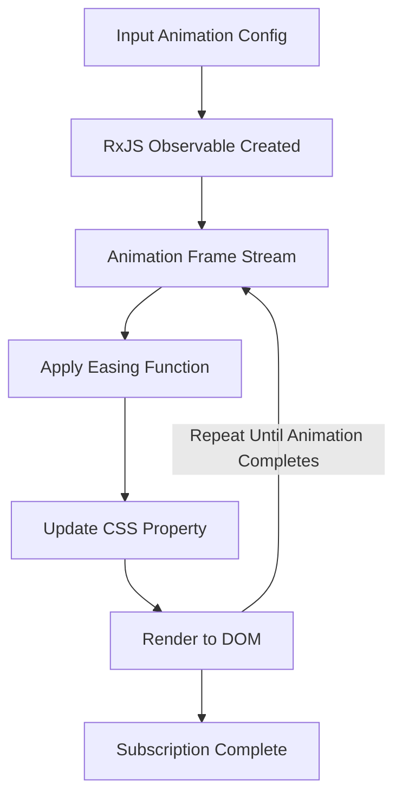

ReAnimate
---
ReAnimate is a powerful and modular reactive animation library built using **RxJS**. It provides an easy way to create smooth, efficient animations using reactive programming techniques. The project is designed with flexibility and composability in mind.

---

## Features
- **Core Animation Logic**: Create animations using RxJS observables.
- **Easing Functions**: Flexible easing functions to customize animation curves.
- **RxJS Integration**: Leverages RxJS operators like `observeOn` for seamless scheduling.

---

## Installation
You can install the library using **yarn** or **npm**:

```shell
yarn add reanimate rxjs
# or
npm install reanimate rxjs
```
## Basic Usage

The core `animate` function generates a stream of animation state updates:

```typescript
import { animate } from 'reanimate';
import { easings } from 'reanimate/easings';

const config = {
    from: 0,
    to: 100,
    duration: 1000,
    easing: easings().easeOutQuad,
};

animate(config).subscribe({
    next: (state) => console.log(state), // Animation updates
    complete: () => console.log('Animation complete!'),
});
```
---

## Easing Functions
The library includes popular easing functions located in the `animation-easings` module. Common functions include:
- `linear`
- `easeInQuad`
- `easeOutQuad`
- `easeInOutCubic`

```typescript
import { easings } from 'reanimate/easings';

const easingFunction = easings().easeOutQuad;
console.log(easingFunction(0.5));
```
---

## How ReAnimate Leverages RxJS

Under the hood, ReAnimate leverages **RxJS observables** to control and stream values over time. Here's a flow diagram of how it works:



---

## Contributing
Contributions are welcomed! Open pull requests for new features, bug fixes, or enhancements.

Steps to contribute:
1. Fork the repository.
2. Create a feature branch.
3. Submit a pull request.

---

## License
This project is licensed under the MIT License. See the LICENSE file for details.

---

## Acknowledgments
- Built on top of the reactive programming capabilities of **RxJS**.
- Simplifies complex animations while maintaining high performance and flexibility.

