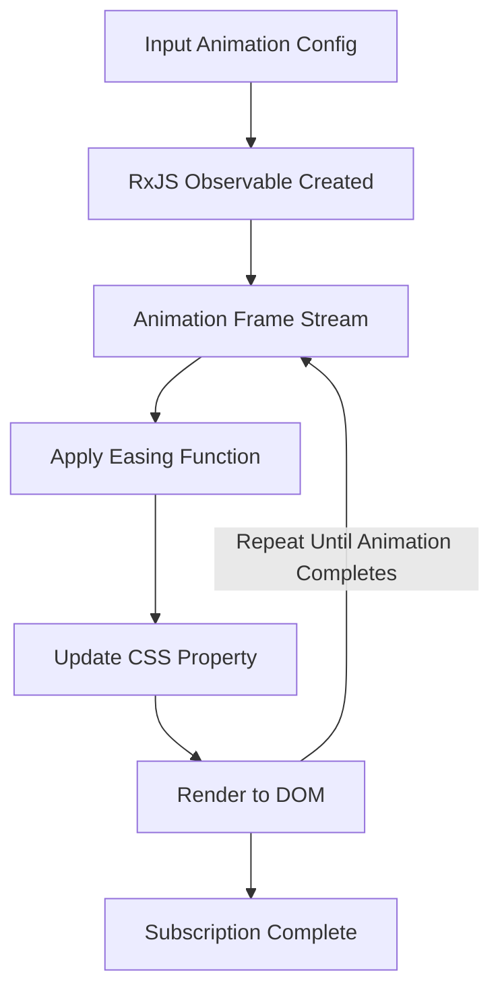

ReAnimate
---
ReAnimate is a powerful and modular reactive animation library built using **RxJS**. It provides a straightforward way to create smooth, efficient animations using reactive programming techniques. The project is designed with flexibility and composability in mind, making it an excellent choice for building complex animation sequences.

---

## Features
- **Core Animation Logic:** The core logic for animations is housed in the `animation-core` module.
- **Utility Functions:** Helper utilities for animation (e.g., DOM bindings) are available in `animation-utils`.
- **Easing Functions:** Flexible easing functions to customize animation curves, located in `animation-easings`.
- **RxJS Integration:** Provides seamless animation creation using RxJS observables and operators.
- **Extensible and Flexible:** Built for developers to easily extend and create custom animations.

---

## Project Structure

### `src/index.ts`
The main entry point of the library. It exports the core functionality, utilities, and easing functions, making them accessible for external use.

### `src/animation-core/animation.ts`
Defines the core animation logic and APIs to create, control, and manage animations. This module serves as the foundation of the library.

### `src/animation-utils/style-binding.util.ts`
Contains utility functions for DOM integration. For example, it may include methods to bind animations directly to DOM elements or manipulate them in real-time.

### `src/animation-easings/easings.ts`
Provides a rich library of easing functions (e.g., linear, ease-in-out) to apply customizable curves to animations.

---

## Installation
You can install the library using **yarn** or **npm**:

```shell
yarn  add reanimate rxjs
```
or:

```shell
npm install reanimate rxjs
```
## Basic Usage

Here’s an example of setting up a basic animation with ReAnimate:

```typescript
import { animate } from 'reanimate';
import { easeOutQuad } from 'reanimate/animation-easings';

// Animate an element's opacity
const element = document.querySelector('.box');
animate({ target: element, property: 'opacity', from: 0, to: 1, duration: 1000, easing: easeOutQuad, }).subscribe();

```

---

## Customizing Animations

ReAnimate's modular architecture allows you to easily extend its functionality or compose your own animation streams. Combine utilities with core animation logic to create tailored behaviors.

```typescript
import { bindToDom } from 'reanimate/animation-utils';
import { animate } from 'reanimate';
// Bind animations to DOM updates
const animation$ = bindToDom(animate({ ... }));
```

---

## Easing Functions
The library includes popular easing functions located in the `animation-easings` module. Common functions include:
- `linear`
- `easeInQuad`
- `easeOutQuad`
- `easeInOutCubic`

```typescript
import { easeInOutCubic } from 'reanimate/animation-easings';

```
---

## How ReAnimate Leverages RxJS

Under the hood, ReAnimate leverages **RxJS observables** to control and stream values over time. Here's a flow diagram of how it works:



---

## Contributing
Contributions are welcomed! Open pull requests for new features, bug fixes, or enhancements.

Steps to contribute:
1. Fork the repository.
2. Create a feature branch.
3. Submit a pull request.

---

## License
This project is licensed under the MIT License. See the LICENSE file for details.

---

## Acknowledgments
- Built on top of the reactive programming capabilities of **RxJS**.
- Simplifies complex animations while maintaining high performance and flexibility.

